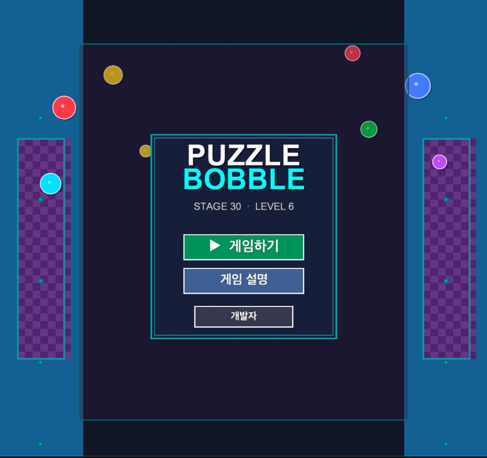
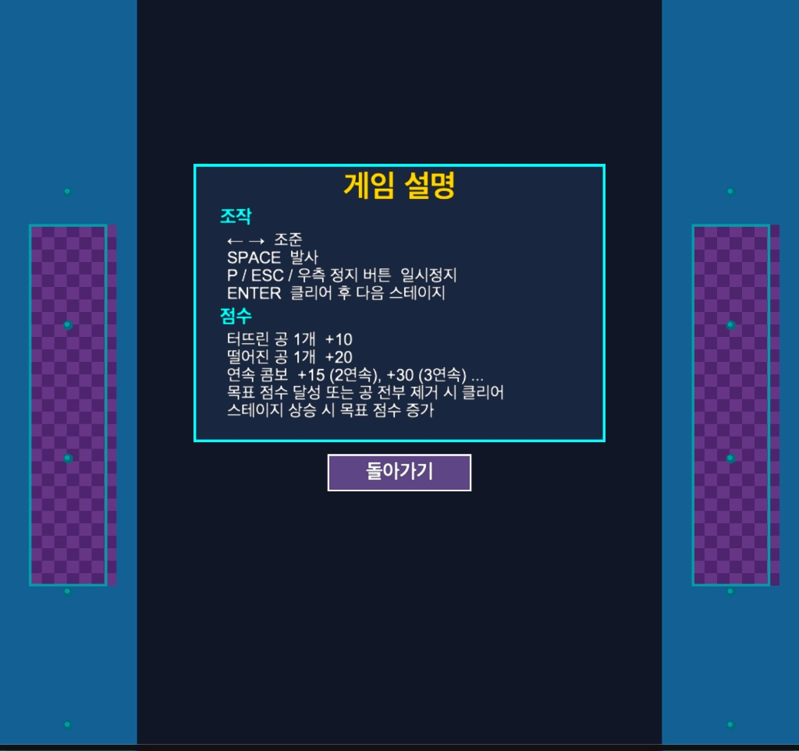
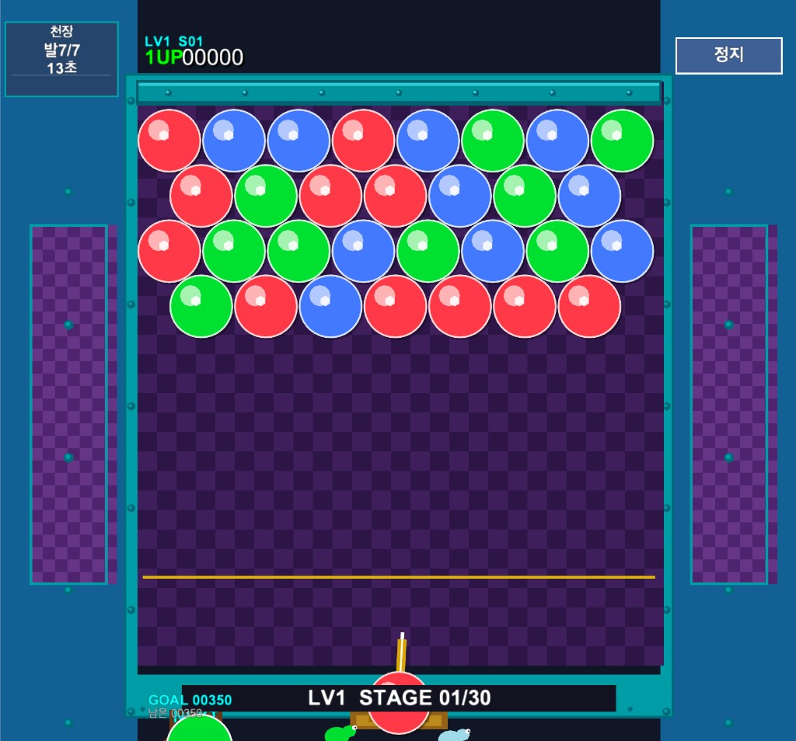
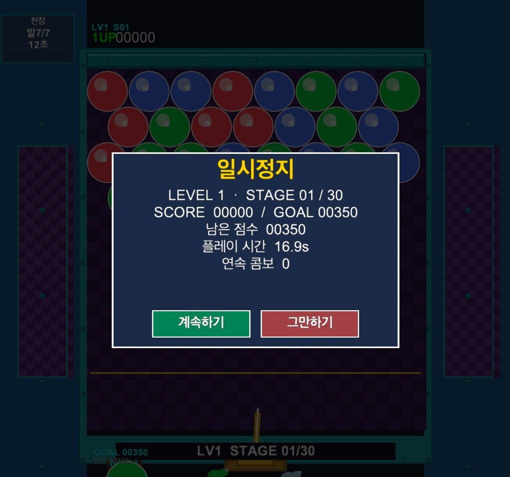
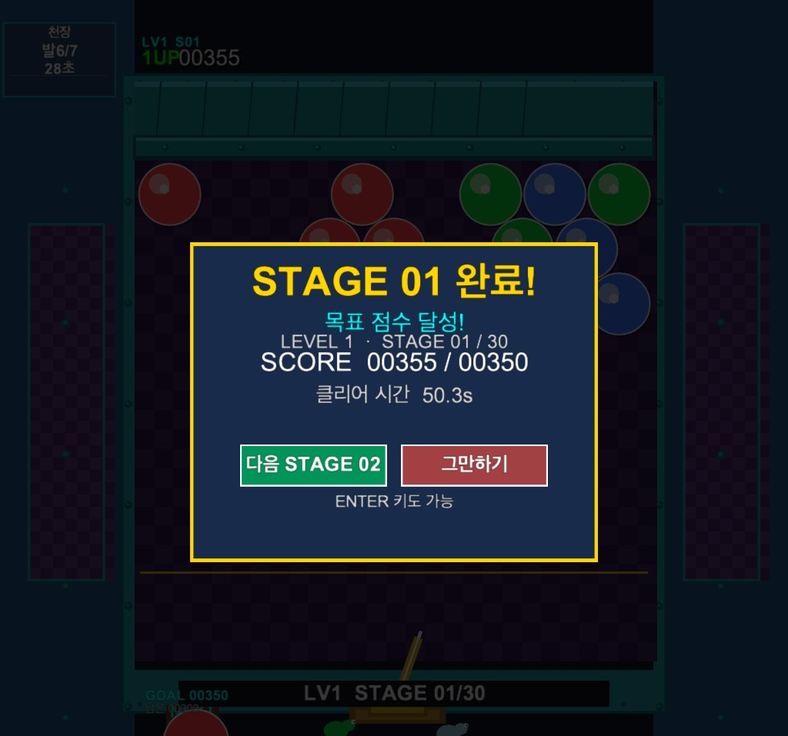
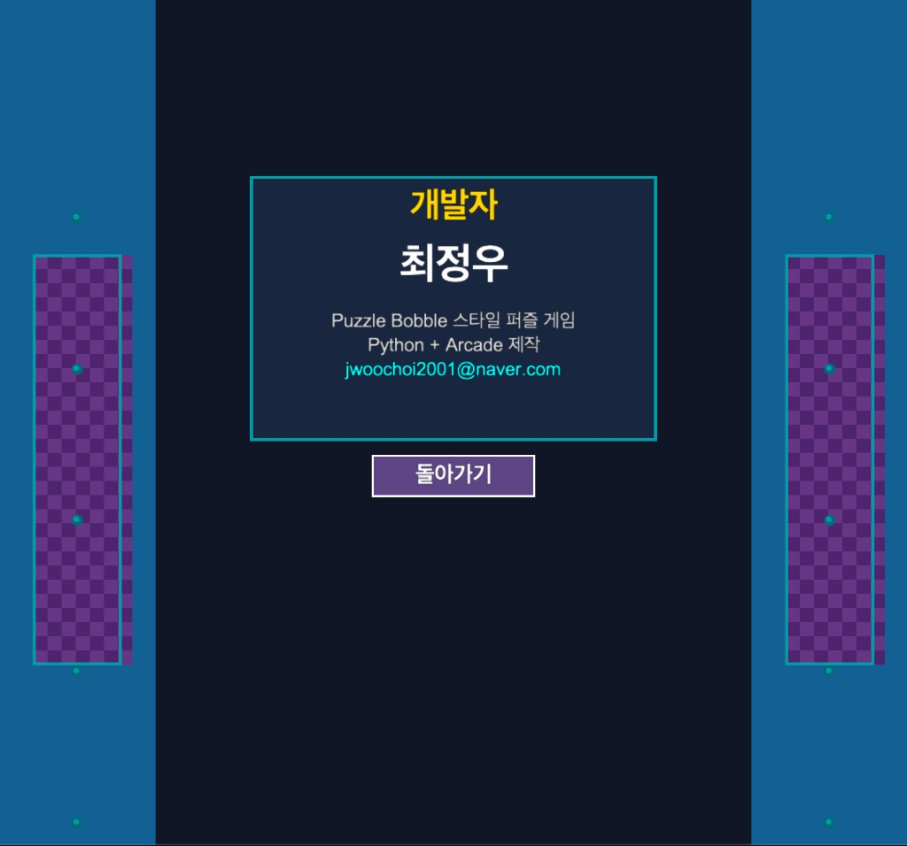

# 🎮 Puzzle Bobble

Python과 Arcade 라이브러리를 활용하여 개발한 **퍼즐 보블** 스타일 아케이드 게임입니다.

같은 색 공을 맞춰 터뜨리고, 천장이 내려오기 전에 목표 점수를 달성하거나 판의 공을 모두 제거하여 **30개 스테이지**를 클리어하는 것이 목표입니다.  
육각 격자, 이중 천장, 콤보 점수, 스테이지 클리어 연출, 랜덤 맵 등을 구현하여 클래식 퍼즐 보블에 가까운 플레이 경험을 제공합니다.

---

## 🎯 게임 소개

Puzzle Bobble는 Python과 Arcade 라이브러리를 활용하여 개발한 2D 버블 슈팅 퍼즐 게임입니다.

조준과 발사, 3개 이상 색 매칭, 매달린 공 제거, 천장 하강, 스테이지별 목표 점수 등 퍼즐 보블의 핵심 요소를 구현하였으며,  
스테이지가 올라갈수록 맵 밀도·색 수·천장 속도·목표 점수가 함께 증가합니다.

---

## ✨ 주요 기능

### 🧩 육각 격자 매칭

나도코딩 퍼즐 보블 방식의 **육각 격자**를 사용합니다.

- 같은 색 공 3개 이상 연결 시 터짐
- 천장과 연결되지 않은 공은 자동 낙하
- 접촉 방향 기반 공 부착

### 📈 30 스테이지 / 6 레벨

총 **30 스테이지**, **6 레벨**로 구성되어 있습니다.

| 레벨 | 스테이지 | 천장 (발사 / 초) |
|------|----------|------------------|
| 1 | 1 ~ 3 | 7 / 28 |
| 2 | 4 ~ 9 | 6 / 25 |
| 3 | 10 ~ 15 | 6 / 22 |
| 4 | 16 ~ 21 | 5 / 20 |
| 5 | 22 ~ 27 | 5 / 17 |
| 6 | 28 ~ 30 | 4 / 14 |

- 같은 레벨은 천장 속도 동일
- 레벨이 올라갈수록 색 수·맵 밀도·난이도 증가
- 스테이지 상승 시 목표 점수 증가 (1스테이지 350 → 30스테이지 53,900)

### ⏱ 이중 천장 시스템

천장은 **발사 횟수**와 **시간** 두 가지 조건으로 하강합니다.

- 일정 발사 횟수마다 1칸 하강
- 일정 시간이 지나면 1칸 하강
- 경고 시 `WALL!` 표시 및 화면 흔들림
- 위험선 아래로 공이 내려오면 게임 오버

### 🎯 클리어 조건

스테이지는 아래 두 가지 방법으로 클리어할 수 있습니다.

- **목표 점수 달성**
- **판의 공 전부 제거**

클리어 후 다음 스테이지로 넘어갈 때, 점수는 해당 스테이지 **목표 점수로 고정 이월**됩니다.

### 🔥 콤보 점수

연속 턴에서 매칭에 성공하면 콤보 보너스가 적용됩니다.

| 항목 | 점수 |
|------|------|
| 터뜨린 공 1개 | +10 |
| 떨어진 공 1개 | +20 |
| 2연속 콤보 | +15 |
| 3연속 콤보 | +30 |

점수는 **5자리**로 표시됩니다. (최대 99,999)

### 💥 폭발·낙하 연출

공이 터지거나 떨어질 때 시각 연출이 적용됩니다.

- 터짐 번쩍임
- 중력 낙하
- 바닥 스플래시
- `+10`, `+20`, `COMBO +N` 점수 플로터
- 스테이지 클리어 시 **연출이 끝난 뒤** 클리어 창 표시

### 🗺 랜덤 맵

재시작할 때마다 맵 구성이 달라집니다.

- 튜토리얼 1~3 스테이지: 위치 고정, 색상 랜덤
- 4~30 스테이지: 레벨별 패턴 풀에서 랜덤 선택
- 좌우 반전, 밀도 증가 등 난이도 변화 적용

### ⏸ 일시정지 / 클리어 메뉴

게임 진행 중 일시정지 및 스테이지 클리어 후 선택이 가능합니다.

- `P` / `ESC` / 우측 **정지** 버튼으로 일시정지
- 클리어 후 **다음 스테이지** 또는 **그만하기** 선택
- 메뉴에서 **게임 설명**, **개발자** 화면 제공

---

## 🕹 조작 방법

| 키 | 기능 |
|----|------|
| `←` `→` | 조준 |
| `SPACE` | 발사 |
| `P` / `ESC` | 일시정지 |
| `ENTER` | 게임 시작 / 클리어 후 다음 스테이지 |
| 마우스 | 메뉴·버튼 클릭 |

---

## 🎮 게임 화면

### 시작 화면



- 게임하기 / 게임 설명 버튼
- 개발자 버튼
- STAGE 30 · LEVEL 6 안내

### 게임 설명 화면



- 조작 방법
- 점수 규칙
- 스테이지 상승 시 목표 점수 증가 안내

### 플레이 화면



- 육각 격자 게임 보드
- 좌측 상단 천장 HUD (발사 횟수 / 시간)
- 상단 점수 · 레벨 · 스테이지 표시
- NEXT 공 미리보기

### 일시정지 화면



- 현재 점수 / 목표 점수
- 플레이 시간
- **계속하기** / **그만하기**

### 클리어 화면



- 스테이지 클리어 결과
- 클리어 시간 표시
- **다음 STAGE** / **그만하기**

### 개발자 화면



- 개발자 정보
- 연락처 이메일

---

## 🧠 객체지향 구조

### Game

게임의 핵심 로직 담당

- 게임 루프
- 입력 처리
- 상태 전환 (메뉴 / 플레이 / 일시정지 / 클리어 / 게임오버)
- 발사 후 매칭·클리어 판정
- 클리어 연출 대기 후 스테이지 전환

### Board

육각 격자 보드 관리

- 공 배치 및 부착
- 천장 오프셋
- 벽 충돌 처리

### Bubble

공 객체

- 이동 / 정지
- 색상 / 위치 관리

### Shooter

발사대

- 조준 각도 조절
- 공 발사

### FloodFill

매칭 및 매달림 판정

- 같은 색 그룹 탐색
- 천장 연결 공 판별
- 매달린 공 제거

### CeilingManager

천장 하강 관리

- 발사 횟수 카운트
- 시간 카운트
- 경고 상태 처리

### StageManager

스테이지 관리

- 스테이지 로드
- 맵 패턴 선택
- 클리어 / 게임오버 판정

### ScoreSystem

점수 및 콤보 관리

- 턴 점수 계산
- 콤보 보너스
- 스테이지 클리어 시 점수 고정 이월

### PopEffectManager

터짐·낙하 연출 관리

- 매칭 / 낙하 애니메이션
- 점수 플로터 표시

### UI

화면 UI 담당

- 메뉴 / HUD / 일시정지 / 클리어 / 게임오버 패널
- 버튼 클릭 영역

---

## 📁 프로젝트 구조

```
puzzle_bobble/
│
├── main.py
├── settings.py
├── requirements.txt
├── README.md
│
├── images/
│   ├── 01_start.png
│   ├── 02_help.png
│   ├── 03_play.png
│   ├── 04_pause.png
│   ├── 05_clear.png
│   └── 06_developer.png
│
└── game/
    ├── game.py
    ├── board.py
    ├── bubble.py
    ├── shooter.py
    ├── floodfill.py
    ├── ceiling.py
    ├── stage.py
    ├── stage_patterns.py
    ├── score.py
    ├── pop_effect.py
    ├── ui.py
    ├── states.py
    ├── difficulty.py
    └── assets.py
```

---

## ▶ 실행 방법

### 1. 프로젝트 다운로드

```bash
git clone https://github.com/jwoochoi2001/Puzzle-Bobble.git
```

### 2. 프로젝트 폴더 이동

```bash
cd Puzzle-Bobble
```

### 3. 가상환경 생성 및 패키지 설치

```bash
python3 -m venv .venv
source .venv/bin/activate        # Windows: .venv\Scripts\activate
pip install -r requirements.txt
```

### 4. 실행

```bash
python3 main.py
```

---

## 💻 개발 환경

| 항목 | 내용 |
|------|------|
| Language | Python 3 |
| Library | Arcade 3.x |
| IDE | PyCharm |
| OS | macOS |

---

## 📌 구현 기능

- 육각 격자 버블 슈팅
- 3개 이상 색 매칭
- 매달린 공 자동 제거
- 이중 천장 시스템 (발사 / 시간)
- 30 스테이지 / 6 레벨
- 스테이지별 목표 점수
- 콤보 점수 시스템
- 공 터짐·낙하 연출
- 랜덤 맵 / 색상
- 일시정지 메뉴
- 스테이지 클리어 메뉴
- 게임 설명 / 개발자 화면
- 게임 오버 / 올클리어 화면

---

## 👨‍💻 개발자

**최정우**

- GitHub: https://github.com/jwoochoi2001
- Email: jwoochoi2001@naver.com

**30 스테이지 ALL CLEAR에 도전해 보세요!**

---

## 🚀 소식

**[2026년]**

- **6월 2일** — 프로젝트 개발 시작
- **6월 11일** — 육각 격자, 발사, 매칭, 천장 시스템 구현
- **6월 13일** — 30 스테이지 / 6 레벨, 점수·콤보 시스템 추가
- **6월 14일** — UI 개선 (메뉴, 일시정지, 클리어, 개발자 화면)
- **6월 15일** — 클리어 연출 완료 후 클리어 창 표시 적용
- **6월 18일** — README 작성 및 GitHub 업로드 준비
